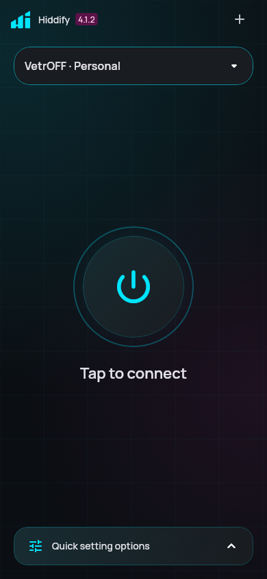

# Material Cyber Glass

The interface uses Material 3 semantics with a quiet graphite canvas, cyan and
violet accents, rounded surfaces, and restrained glass highlights. Light and
OLED black themes remain available. Platform dynamic color schemes retain their
foreground/background pairs instead of being silently discarded. Typography
uses the bundled Manrope variable font (including Cyrillic) and the existing
Persian/emoji fallbacks, with a clear
heading hierarchy and tabular digits for statistics. No runtime font downloads
are required.

The home screen prioritizes the active subscription, connection control, server,
and quick settings. Empty profiles have an explicit add action. Settings use
separate section cards; proxy cards expose selection and delay. App-wide theme
tokens also cover forms, dialogs, chips, sheets, switches, and menus.

## Material migration

`dynamic_color` 2.1.0 returns `material_ui.ColorScheme`. Application and test
imports therefore use `material_ui`, with `cupertino_ui` for Cupertino widgets.
Material localizations come from `material_ui`. An app-level
`MaterialUiCompatibilityBridge` provides legacy theme/localization types to
third-party widgets that have not migrated yet. The bridge is a temporary,
deprecated upstream migration utility and should be removed once those packages
are migrated; do not remove it while legacy Material widgets remain.

## Rendering policy

General settings expose three persisted effect modes:

| Mode | Background blur | Decorative motion |
| --- | --- | --- |
| Automatic | Desktop only | Short state transitions; static mobile placeholders/text |
| Glass and motion | Small clipped regions | Short transitions, desktop-style shimmer/marquee |
| Reduced | Disabled | Disabled |

System `disableAnimations` and `accessibleNavigation` override all modes. The
automatic policy deliberately avoids unreliable hardware guessing: mobile
devices default to the inexpensive implementation. It is not a benchmark-based
device classifier or an OS battery-saver detector.

The backdrop is a static, repaint-isolated vector gradient/grid. There is no
full-screen filter, image decode, particle loop, or permanently running idle
connection animation. Glass buttons use a specular gradient; real backdrop
filters are confined to the connection control and quick settings. Scrolling
cards never use backdrop filters. Profile rows avoid intrinsic-height layout.
Proxy grids and profile lists remain lazily built. Text scaling, semantic labels,
48 dp actions, RTL layout, and keyboard navigation are retained.

## Verification and device profiling

Use the pinned Flutter SDK from `pubspec.yaml`:

```sh
flutter pub get
dart run slang
dart run build_runner build
flutter analyze --no-fatal-infos --no-fatal-warnings
flutter test
```

The migration tests verify platform color schemes, the legacy bridge,
accessibility overrides, and that reduced/automatic-mobile modes create no
backdrop filters. UI tests should cover compact screens, large text, and RTL.

For performance claims, run on a physical low-end Android device in **profile**
mode, using the same subscription/server and effect mode for before/after runs.
Record raster/build frame times, idle CPU, memory after repeated navigation, and
scroll jank for a large proxy list in Flutter DevTools. Use 16.7 ms as the 60 Hz
frame budget (8.3 ms at 120 Hz). Check disconnected idle, connecting, connected
stats updates, scrolling, and background/resume. Debug-mode widget tests do not
establish FPS, battery life, or a measured speedup.

## Verified in this change

- Dependency resolution and both source generators completed with Flutter 3.47.5.
- Analyzer completed with zero compilation errors; existing warnings/info remain.
- All 26 tests passed, including three home layout/golden tests.
- The existing async runtime regression checker passed.
- Physical-device FPS, memory and battery measurements have not been performed.

The snapshots below render the real home widget with deterministic local test
providers, without a VPN session. They include the app background; navigation
belongs to the separate router shell.

| Dark | Large text | RTL |
| --- | --- | --- |
|  |  |  |
